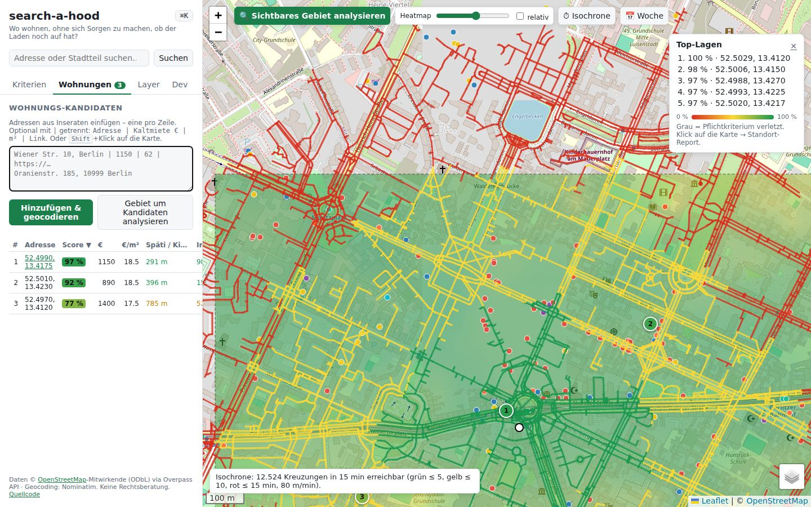
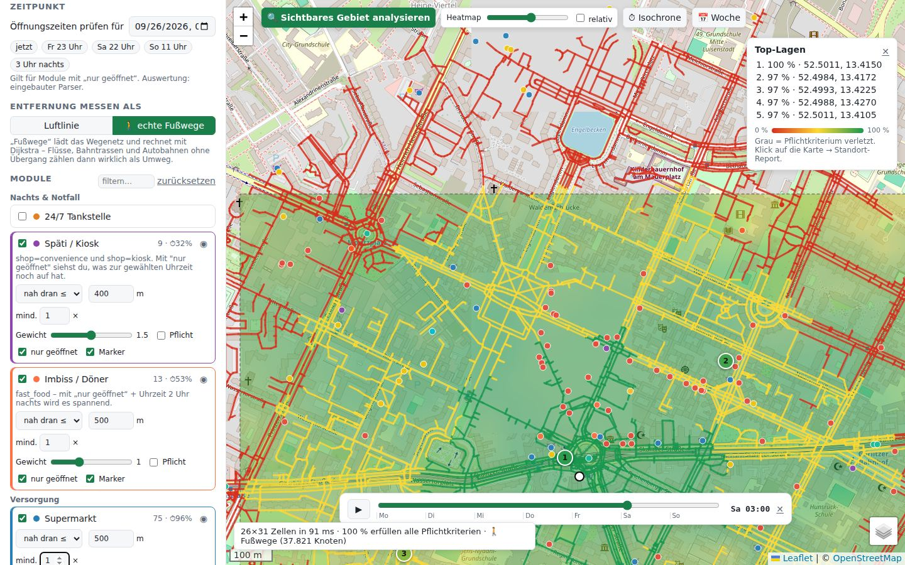
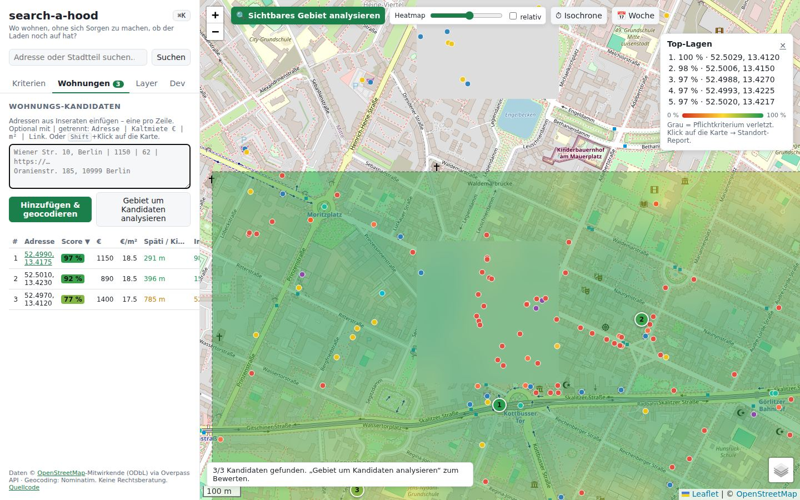
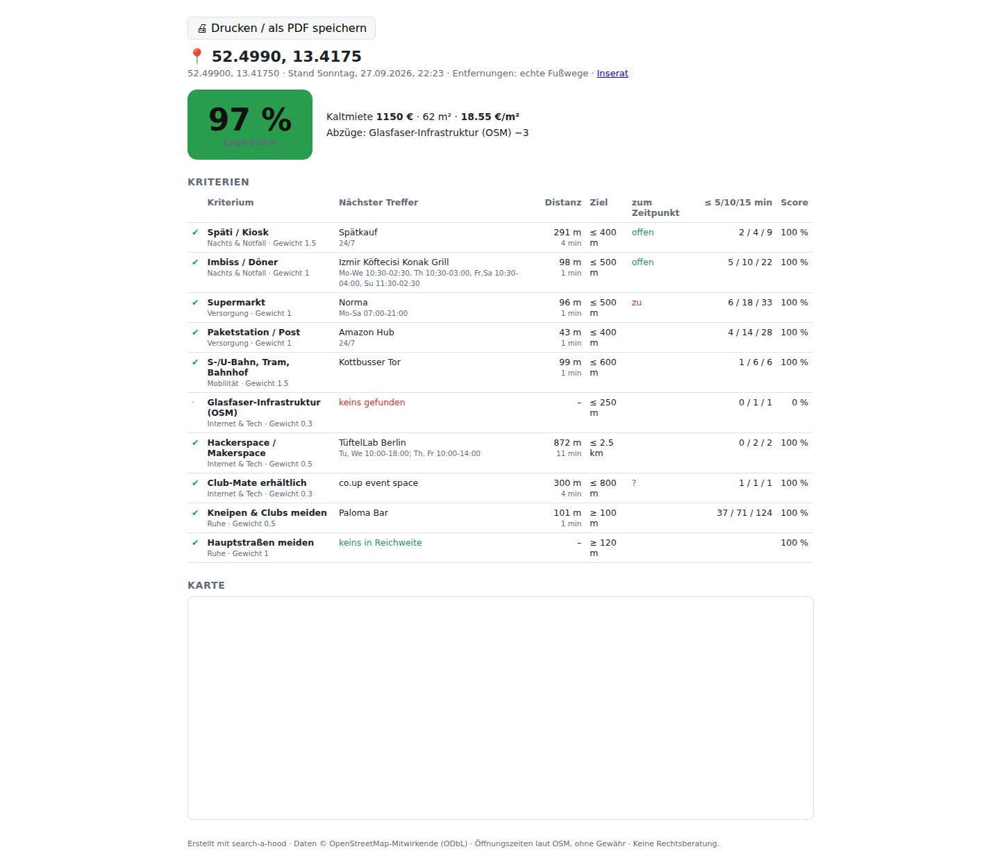
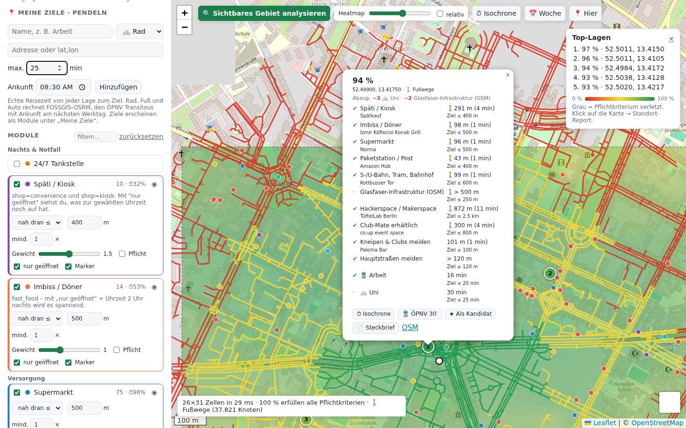
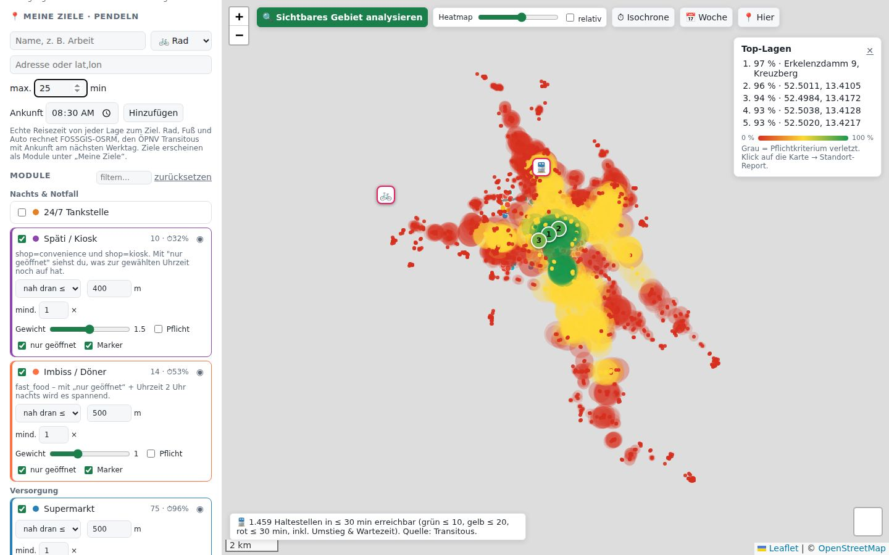
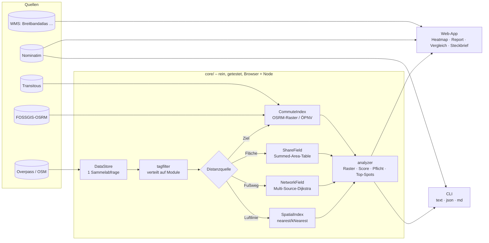

# search-a-hood 🏘️

**Live:** https://vsvito420.github.io/search-a-hood/

**Ein modulares OSINT-Tool für die Wohnungssuche.** Du legst beliebige Kriterien übereinander, zum Beispiel eine 24/7-Tankstelle in max. 800 m, einen Späti, der Freitag um 23 Uhr noch offen hat, S-Bahn nah, mehr als 120 m bis zur Hauptstraße und außerhalb der Bubatz-Sperrzonen. Das Tool zeigt dir dann als Heatmap, **wo** in der Stadt das alles zusammenpasst: nach Luftlinie oder nach **echten Fußwegen**.

> „Wo kann ich wohnen, ohne mir Sorgen zu machen, ob der Laden noch auf hat oder der Weg zu lang ist?“



- Keine Build-Tools, kein Backend, keine API-Keys. Die App ist eine statische Seite mit ES-Modulen.
- Die Daten kommen live aus OpenStreetMap (Overpass), dazu optionale Behörden-Geodaten per WMS.
- Es gibt Web-App **und** Headless-CLI mit demselben Kern.

---

## Features

| | |
|---|---|
| 🧩 **Module** | 33 Kriterien in 9 Kategorien, vom 24/7-Späti über Waschsalon und Glasfaser bis zum **Grünanteil im Umkreis**. Eigene Module legst du per Overpass-Filter direkt in der UI an, ohne Code. |
| 🎯 **Scoring** | „nah dran ≤ X m“ oder „weit weg ≥ X m“, Gewicht 0–3, Pflichtkriterien, „mind. N im Umkreis“ (k-nächster Treffer) |
| 🚶 **Echte Fußwege** | Das Wegenetz wird als Graph im Browser aufgebaut, pro Modul läuft ein Multi-Source-Dijkstra. Flüsse, Gleise und Autobahnen ohne Übergang zählen dann als Umweg. |
| 🌳 **Grünanteil** | Wie viel Prozent der Umgebung (±300 m) sind Park, Wald, Wiese oder Kleingarten? Die Polygone inklusive Multipolygon-Relationen werden gerastert und per Summed-Area-Table ausgewertet. |
| 📍 **Hier-Check** | Bei der Besichtigung vor der Haustür reicht ein Tap: GPS-Position → Analyse → Report. Die App ist aufs Handy installierbar (Web-App-Manifest). |
| 🎯 **Pendel-Check** | „Arbeit ≤ 25 min mit ÖPNV“, „Uni ≤ 20 min mit dem Rad“ wird zum Kriterium wie jedes andere. Rad, Fuß und Auto kommen von FOSSGIS-OSRM, ÖPNV von Transitous (MOTIS) mit echtem Fahrplan und Ankunftszeit. |
| ⏱ **Isochronen** | Was ist in 5/10/15 Minuten zu Fuß erreichbar? Die Darstellung ist ein Netz aus Straßensegmenten. Dazu kommt eine **ÖPNV-Isochrone**: alle Haltestellen, die ab dem Klickpunkt in 30 min mit echtem Fahrplan erreichbar sind, inklusive Umstiegen. |
| 🕒 **Öffnungszeiten** | Mit „nur geöffnet“ zählen nur Treffer, die zum gewählten Zeitpunkt offen sind. Schnellwahl für Fr 23 Uhr, 3 Uhr nachts usw. |
| 📅 **Wochen-Zeitraffer** | Mit dem Slider oder ▶ gehst du stundenweise durch die Woche, die Heatmap rechnet live mit. |
| 🏠 **Wohnungsvergleich** | Adressen aus Inseraten einfügen (`Adresse \| Miete \| m² \| Link`). Sie werden geocodiert, bewertet und in einer sortierbaren **Score-Matrix** gezeigt (Zelle = Kriterium, Farbe = Erfüllungsgrad), CSV-Export inklusive. Mit **⚖ Einzelbewertung** geht das auch, wenn die Wohnungen über die ganze Stadt verteilt sind. |
| 📄 **Steckbrief** | Druckbare Seite pro Lage: Kurzfazit („Stark: … Schwach: …“), Score, Abzüge, nächste Treffer mit Öffnungsstatus, Anzahl in 5/10/15 min, Karte |
| 🌐 **Glasfaser & Co.** | Breitbandatlas der BNetzA als WMS-Overlay, am Klickpunkt per GetFeatureInfo abfragbar. Dazu OSM-Indikatoren (Telekom-Verteiler, Mobilfunkmasten, freies WLAN). |
| 🗺 **Overlays** | Beliebige WMS- oder XYZ-Dienste (Lärmkarten, Hochwasser, Bodenrichtwerte …), Layer-Liste per GetCapabilities |
| 🔍 **Analyse-Werkzeuge** | Einzelansicht pro Kriterium (◉), relative Farbskala, „Warum nicht 100 %?“-Erklärung, Datenqualität (Anteil mit Öffnungszeiten) |
| ⌨️ **Für Devs** | Befehlspalette (⌘K), Tastenkürzel, Permalinks, Deep-Links (`?addr=…&preset=…&run=1`), Config-Import/Export, GeoJSON-Export, eigene Overpass-Instanz, `window.searchAHood` in der Konsole |
| 💻 **CLI** | `search-a-hood score "Adresse" -p informatiker --walk --json` |

| Wochen-Zeitraffer: Sa 03:00 | Wohnungsvergleich (Score-Matrix) | Steckbrief |
|---|---|---|
|  |  |  |
| **Pendel-Check: 🚆 Arbeit & 🚲 Uni im Report** | **ÖPNV-Isochrone: 30 min ab Kotti** | |
|  |  | |

### Presets

| Preset | Idee |
|---|---|
| 🧑‍💻 **Informatiker** | Breitbandatlas-Overlay, Späti und Döner nachts offen, Bahn nah, Paketstation, Hackerspace, Club-Mate, Ruhe vor Clubs und Hauptstraßen |
| 🌙 Nachteule | 24/7-Tanke, Späti mit Öffnungszeiten-Check, Bahn |
| 🌿 Ruhig & grün | Park nah; Hauptstraßen, Gleise und Clubs weit weg |
| 🥦 Bubatz-freundlich | Hauseingang außerhalb der 100-m-Zonen nach KCanG § 5 und, zwischen 7 und 20 Uhr, außerhalb von Fußgängerzonen (beides Pflicht). Dazu Späti, Tanke und Park. Der Zeitraffer zeigt den Unterschied zwischen Tag und Nacht. |
| 👨‍👩‍👧 Familie | Schule/Kita, Arzt, Apotheke, Supermarkt, Park, ohne Hauptstraße |

---

## Schnellstart

```bash
npm start            # http://localhost:8080 – statischer Server ohne Abhängigkeiten
npm test             # Unit-Tests (node:test)
```

1. Auf ein Viertel zoomen (max. ca. 60 km², für Fußwege max. ca. 30 km²)
2. Ein Preset wählen oder die Module einzeln einstellen
3. **A** drücken oder „Sichtbares Gebiet analysieren“ klicken
4. Die Karte anklicken, um den Standort-Report zu sehen. „📄 Steckbrief“ öffnet die druckbare Version.

Grün heißt, die Lage passt. Rot heißt, sie passt nicht. Grau heißt, ein Pflichtkriterium ist verletzt.

### Deep-Links

Die App lässt sich per URL steuern, etwa aus einer Tabelle mit Inseraten oder einem Bookmark:

```
index.html?addr=Oranienstraße 185, Berlin&preset=informatiker&run=1
index.html?at=52.4986,13.418&z=16&walk=1&time=2026-10-02T23:00&run=1
```

`addr` oder `at` bestimmen den Ort, `z` den Zoom. Dazu kommen `preset`, `walk=1` und `time`. Mit `run=1` wird sofort analysiert und der Report geöffnet.

### Tastenkürzel

| Taste | Aktion |
|---|---|
| <kbd>Ctrl</kbd>/<kbd>⌘</kbd>+<kbd>K</kbd> | Befehlspalette: Module, Presets, Zeitpunkte, Kandidaten, Exporte |
| <kbd>A</kbd> | Sichtbares Gebiet analysieren |
| <kbd>W</kbd> | Luftlinie ↔ Fußwege |
| <kbd>I</kbd> | Isochrone am letzten Klickpunkt |
| <kbd>T</kbd> / <kbd>Leertaste</kbd> | Wochen-Zeitraffer öffnen / abspielen |
| <kbd>R</kbd> | Relative Farbskala |
| <kbd>/</kbd> | Adresssuche |
| <kbd>1</kbd>–<kbd>4</kbd> | Tabs |
| <kbd>Shift</kbd>+Klick | Kandidat an dieser Stelle anlegen |

---

## CLI

Dieselbe Bewertungslogik läuft ohne Browser, zum Beispiel für Skripte, Cronjobs („neue Inserate automatisch prüfen“) oder CI.

```bash
node bin/search-a-hood.mjs score "Oranienstraße 185, Berlin" "Wiener Straße 10, Berlin" -p informatiker
```

```
10 Kriterien · Luftlinie · Zeitpunkt So., 27.09., 22:18 · Preset informatiker

#1 Wiener Straße 10, Kreuzberg, Berlin  52.49809, 13.42755
   Score 96 %
   ✔ Späti / Kiosk                  78 m (1 min)           ≤ 400 m      Spätify
   ✔ Imbiss / Döner                 109 m (1 min)          ≤ 500 m      Khartoum
   ✔ S-/U-Bahn, Tram, Bahnhof       135 m (2 min)          ≤ 600 m      Görlitzer Bahnhof
   ✔ Club-Mate erhältlich           587 m (7 min)          ≤ 800 m      co.up event space
   · Kneipen & Clubs meiden         83 m (1 min)           ≥ 100 m      Wiener Blut
   …
```

```bash
# Pendel-Ziele: ÖPNV mit Ankunft 08:30 am nächsten Werktag, Rad per OSRM
node bin/search-a-hood.mjs score "Oranienstraße 185, Berlin" "Schillerpromenade 20, Berlin" -m supermarket \
  -g "Arbeit|Alexanderplatz, Berlin|transit|25" -g "Uni|Ernst-Reuter-Platz, Berlin|bike|25"
#1 Oranienstraße 185, Kreuzberg, Berlin      Score 88 %
   ✔ Supermarkt   60 m (1 min)   ✔ 🚆 Arbeit   18 min   · 🚲 Uni   33 min
#2 Schillerpromenade 20, Neukölln, Berlin    Score 75 %
   ✔ Supermarkt  313 m (4 min)   · 🚆 Arbeit   29 min   · 🚲 Uni   38 min

# Fußwege, Zeitpunkt Samstag 3 Uhr, eigene Einstellungen, JSON für jq
node bin/search-a-hood.mjs score 52.4986,13.418 -p nachteule --walk -t 2026-10-03T03:00 \
  -s spaeti.distance=300 -s supermarket.minCount=2 --json | jq '.results[0].score'

node bin/search-a-hood.mjs modules     # alle Module mit Defaults
node bin/search-a-hood.mjs presets
```

### Watchlist als GitHub Action

`watchlist.example.txt` nach `watchlist.txt` kopieren und mit Inseraten füllen (`Adresse | Miete | m² | Link`). Dann unter **Actions → Watchlist → Run workflow** starten. Das Ranking landet als Tabelle in der Job-Zusammenfassung:

| # | Adresse | Score | € | €/m² | 24/7 Tankstelle | Späti / Kiosk | Supermarkt | S-/U-Bahn | 🚆 Arbeit |
|---|---|---|---:|---:|---:|---:|---:|---:|---:|
| 1 | Oranienstraße 185, Kreuzberg | **100 %** | 1150 | 18.5 | ✅ 205 m | ✅ 191 m | ✅ 60 m | ✅ 163 m | ✅ 18 min |
| 4 | Schillerpromenade 20, Neukölln | **81 %** | 890 | 15.3 | ⚠️ 1.3 km | ✅ 229 m | ✅ 313 m | ✅ 368 m | ⚠️ 29 min |

Lokal geht das genauso: `node bin/search-a-hood.mjs score --file watchlist.txt -p nachteule --format md`.

Optionen: `--preset/-p`, `--modules/-m a,b,c`, `--set/-s modul.key=wert` (mehrfach), `--goal/-g "Name|Adresse|bike/transit/foot/car|Minuten"` (mehrfach), `--arrive hh:mm`, `--walk/-w`, `--time/-t ISO`, `--file/-f`, `--format text|json|md`, `--json`, `--overpass URL` (oder `OVERPASS_URL`). Hinter einem HTTP-Proxy setzt du `NODE_USE_ENV_PROXY=1`.

---

## Wie gerechnet wird

**Raster:** Das sichtbare Gebiet wird in Zellen von ca. 50 m geteilt (max. 160 × 160). Für jede Zelle und jedes Modul wird der nächste Treffer gesucht, bei „mind. N“ der N-nächste. Die Daten werden **mit Rand** geladen, damit Lagen am Bildrand nicht besser aussehen, als sie sind.

**Score pro Modul** (0–1):

- `nah dran ≤ D`: 1 bis D, danach linearer Abfall auf 0 bei 2·D
- `weit weg ≥ D`: ab D gibt es 1, darunter sinkt der Wert linear bis 0 bei 0 m

**Gesamtscore:** gewichteter Mittelwert. Ist ein Pflichtkriterium verletzt, wird die Lage ausgeschlossen. Bei Gleichstand gewinnt die Lage, bei der alles noch näher bzw. Störendes noch weiter weg ist.

**Performance:** Der Nächster-Nachbar-Index rechnet mit einer Equirectangular-Näherung (Abweichung zu Haversine < 0,01 % auf Stadtebene) und numerischen Bucket-Schlüsseln. Der Worst Case mit 160×160 Zellen und 12 Modulen à 5.000 POIs dauert etwa 320 ms (vorher 800 ms). Ein Graph mit 40.000 Knoten ist in etwa 45 ms gebaut, ein Multi-Source-Dijkstra dauert etwa 9 ms.

**Fußwege:** `highway=footway|path|residential|…` ohne `foot=no` wird zu einem CSR-Graph. Isolierte Mini-Komponenten wie Wege in Innenhöfen werden verworfen. Pro Modul läuft **ein** Multi-Source-Dijkstra von allen POIs aus, dann kennt jeder Knoten die Gehdistanz zum nächsten POI. Jede Rasterzelle wird auf den nächsten Knoten gesnappt. In Kreuzberg sind das rund 38.000 Knoten, und die komplette Heatmap in Fußwegen dauert etwa 100 ms. Lärm- und Sichtweiten-Kriterien (Linien, „weit weg“) bleiben bewusst bei der Luftlinie.

**Pendeln:** Für Rad, Fuß und Auto fragt eine einzige OSRM-Table-Anfrage die Reisezeit zum Ziel von einem 9×9-Stützraster über dem Gebiet ab. Dazwischen wird bilinear interpoliert, denn Reisezeit ändert sich räumlich glatt. Für den ÖPNV liefert Transitous `one-to-all` mit `arriveBy` alle Haltestellen, von denen man rechtzeitig ankommt. Jede Zelle nimmt dann das Minimum aus „Fahrzeit ab Haltestelle + Fußweg dorthin“ und „direkt zu Fuß“. Ein Ziel ist technisch ein Modul mit der Einheit Minuten, deshalb funktionieren Gewicht, Pflicht, Einzelansicht, Report, Vergleichstabelle und CLI automatisch.

**Öffnungszeiten:** Primär wird [opening_hours.js](https://github.com/opening-hours/opening_hours.js) verwendet, lazy geladen und mit Feiertagen. Fällt das aus, übernimmt ein eingebauter Parser (`src/core/oh-lite.js`) die gängigen Muster: Tagesbereiche, Mittagspausen, Zeiten über Mitternacht, `off`, `24/7`. Kann er einen Wert nicht sicher auswerten, gilt er als unbekannt, er wird nie geraten.

**Cache:** Overpass-Antworten (inklusive Wegenetz) liegen 24 h in IndexedDB. Ein erneuter Besuch desselben Gebiets braucht dann keine Serveranfrage mehr, im Test sank die Zeit von 33 s auf 4 s. Im Dev-Tab lässt sich der Cache leeren.

**Tag-Filter:** Alle Module gehen in **eine** Overpass-Abfrage. Ein eigener Parser für Overpass-QL-Filter (`[k=v]`, `[k~"re",i]`, `[k!=v]`, `[!k]` …) verteilt die Antwort lokal auf die Module. Schlägt die Sammelabfrage fehl, wird einzeln nachgeladen, und die Instanz wird bei Fehlern gewechselt (mit Backoff).

---

## Datenqualität: ehrlich gesagt

- **Öffnungszeiten** fehlen in OSM oft. In Kreuzberg haben z. B. nur ca. 30 % der Spätis `opening_hours`, bei Supermärkten sind es über 95 %. Die Modul-Karte zeigt den Anteil (⏱ xx %). Bei „nur geöffnet“ zählen nur Treffer mit bekannten Zeiten.
- **Glasfaser** ist in OSM kaum erfasst. Das OSM-Modul ist nur ein Indikator mit niedrigem Gewicht. Verbindlich ist der **Breitbandatlas** (Tab „Layer“ → „Layer abrufen“ → z. B. einen FTTH-/Gigabit-Layer wählen). Ein Klick auf die Karte fragt die Versorgung am Punkt ab.
- **Bubatz-Zonen** nähern § 5 KCanG an: 100 m um Schulen, Kitas, Spielplätze, Jugendeinrichtungen und öffentliche Sportstätten, dazu Fußgängerzonen von 7 bis 20 Uhr (zeitabhängig). Das ist **keine Rechtsberatung**. „Sichtweite“ ist Auslegungssache, und bei großen Fußgänger-Plätzen wird zum Rand bzw. zur Mittellinie gemessen.

---

## Eigene Module

**In der UI:** „➕ Eigenes Modul“ mit Overpass-Filter, z. B. `[amenity=vending_machine][vending=cigarettes]` oder `[cuisine~"ramen",i]`. Optional mit Öffnungszeiten oder als Linie (Straßen, Flüsse).

**Im Code:** eine Datei in `src/modules/` anlegen und in `src/modules/index.js` registrieren:

```js
// src/modules/doener.js
import { defineModule } from './define.js';

export default defineModule({
  id: 'doener',
  name: 'Dönerladen',
  category: 'Versorgung',
  color: '#c0392b',
  query: ['[amenity=fast_food][cuisine~"kebab"]'], // Overpass-Tag-Filter (ODER-verknüpft)
  supportsHours: true,                              // bietet „nur geöffnet“ an
  // geometry: 'line',                              // Abstand zu Linien (Straßen, Gleise, Flüsse)
  // zone: true,                                    // Radius um jeden Treffer zeichnen
  // filter: (el, { time, isOpenAt }) => el.tags.diet_halal === 'yes',
  defaults: { mode: 'near', distance: 400, weight: 1, minCount: 1 },
});
```

Presets sind reine Einstellungs-Pakete in `src/presets.js` (optional mit `overlays: ['breitbandatlas']`).

---

## Architektur



Jede Distanzquelle hat dieselbe Schnittstelle `nearest(lat, lon, max) → {item, dist}`. Deshalb laufen Luftlinie, Fußwege, Grünanteil und Pendelzeiten ohne Sonderfälle durch Analyzer, Report, Vergleichstabelle und CLI.

```
index.html · styles.css
bin/search-a-hood.mjs        Headless-CLI (gleicher Kern wie die Web-App)
src/
  main.js                    Verdrahtung: Karte, Tabs, Laden → Filtern → Bewerten → Zeichnen
  presets.js
  app/                       store (localStorage), permalink (Zustand ↔ URL)
  core/                      rein & getestet, läuft in Browser und Node
    overpass.js              Query-Builder, Sammelabfrage, Klassifizierung, Fallback-Instanzen
    tagfilter.js             Parser/Matcher für Overpass-QL-Tag-Filter
    datastore.js             Daten pro Gebiet, Sammel- → Einzelabfrage
    spatial-index.js         Hash-Grid: nearest, kNearest, within
    routing.js               Wegenetz → CSR-Graph, Dijkstra (Min-Heap), NetworkField, Isochronen
    commute.js               Pendelzeiten: OSRM-Table (bilinear) + Transitous (one-to-all)
    share.js                 Flächenanteil: Ringe zusammensetzen, Scanline-Raster, Summed-Area-Table
    analyzer.js · scoring.js Raster, Score, Pflicht, Gleichstand, Top-Spots
    hours.js · oh-lite.js    Öffnungszeiten (Bibliothek + eigener Fallback-Parser)
    places.js                Einzelbewertung: Orte gruppieren, kleine Abfragen, Ziele exakt (CLI + Web)
    candidates.js            Eingabe-Parser, Geocoder (1 req/s + Cache), CSV
    geo.js                   Distanzen, Raster, Linien verdichten, bbox-Padding
  modules/                   ein Kriterium pro Datei + Registry
  ui/                        Panel, Popups, Overlays (WMS), Kandidaten, Palette, Steckbrief
tests/                       node:test (Unit) + e2e/smoke.mjs (Playwright)
```

### Tests & Benchmark

```bash
npm run bench                              # Hot Path: Raster-Analyse, Graph-Aufbau, Dijkstra
npm run lint                               # ESLint (ohne Plugins, Konfiguration in eslint.config.js)
npm test                                   # Unit-Tests: Geo, Index, Scoring, Tag-Filter, Routing, Öffnungszeiten, CLI …
npm start & node tests/e2e/smoke.mjs shot  # End-to-End im echten Chromium, speichert Screenshots
OVERPASS_VIA_CURL=1 node tests/e2e/smoke.mjs   # hinter Proxies, die CORS-Header entfernen
```

GitHub Actions führt Syntax-Check, Lint und Unit-Tests auf Node 20 und 22 aus (`.github/workflows/ci.yml`). Live ist die App unter **https://vsvito420.github.io/search-a-hood/**. GitHub Pages veröffentlicht sie direkt aus `main` (Settings → Pages → „Deploy from branch“), `.nojekyll` sorgt dafür, dass die Dateien unverändert ausgeliefert werden.

---

## Ideen

- Lärmkarten der Länder als vorkonfigurierte Overlays (Berlin, Hamburg, NRW …)
- ÖPNV-Isochronen (GTFS + RAPTOR im Browser)
- Mietspiegel, Bodenrichtwerte (BORIS-D), Hochwasser-Gefahrenkarten
- Ookla Open Data (gemessene Bandbreite je Kachel) als Internet-Modul
- Beobachtungsliste: CLI + Cron + neue Inserate → Benachrichtigung bei Score > X

## Datenquellen

| Quelle | Wofür | Hinweis |
|---|---|---|
| [OpenStreetMap](https://www.openstreetmap.org) via [Overpass API](https://overpass-api.de) | POIs, Wegenetz | ODbL, Fair Use, eigene Instanz einstellbar |
| [Nominatim](https://nominatim.org) | Adresssuche | max. 1 Anfrage/s, Ergebnisse gecacht |
| [FOSSGIS-OSRM](https://routing.openstreetmap.de) | Reisezeiten Rad/Fuß/Auto | Table-Service, 1 Anfrage pro Ziel und Gebiet |
| [Transitous](https://transitous.org) (MOTIS) | ÖPNV-Reisezeiten | Community-Projekt, bitte sparsam nutzen |
| [Breitbandatlas BNetzA](https://gigabitgrundbuch.bund.de) | Breitband/Glasfaser (WMS) | amtliche Daten |
| [opening_hours.js](https://github.com/opening-hours/opening_hours.js) | Öffnungszeiten inkl. Feiertage | lazy geladen, sonst eigener Parser |

## Sicherheit

Alle Fremddaten werden vor dem Einfügen ins HTML escaped: OSM-Tags, Permalinks, importierte Configs, WMS-Antworten. Links werden nur mit `http(s)` gesetzt. Leaflet wird mit SRI-Hash geladen und fällt bei Ausfall auf ein zweites CDN zurück.

## Lizenz & Daten

Code: MIT. Kartendaten © [OpenStreetMap](https://www.openstreetmap.org/copyright)-Mitwirkende (ODbL), abgefragt über die Overpass API. Geocoding über Nominatim. Nutze die öffentlichen Server fair: kleine Gebiete, keine Massenabfragen, und für viel Last eine eigene Overpass-Instanz.
